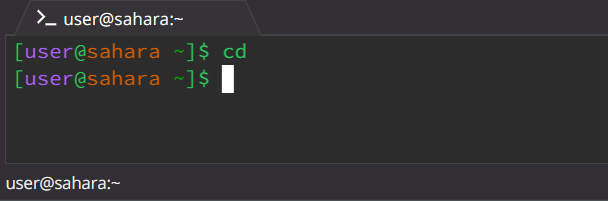
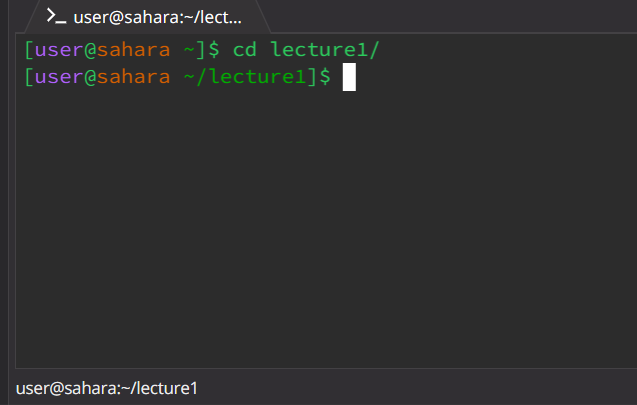
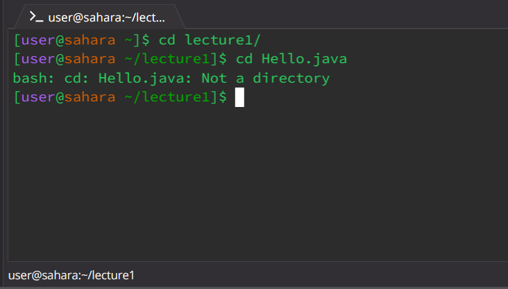
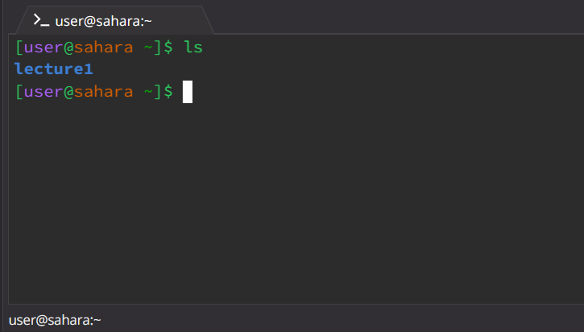
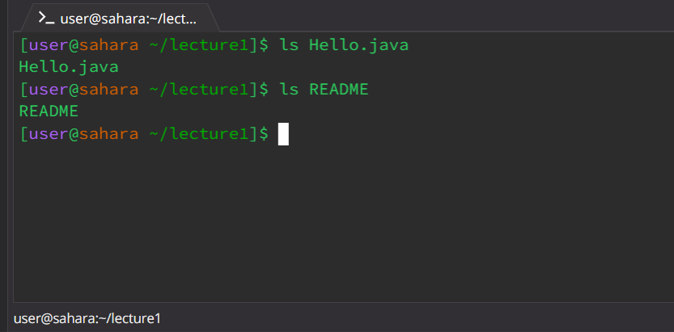
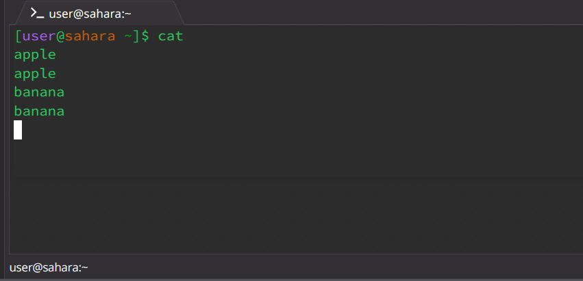
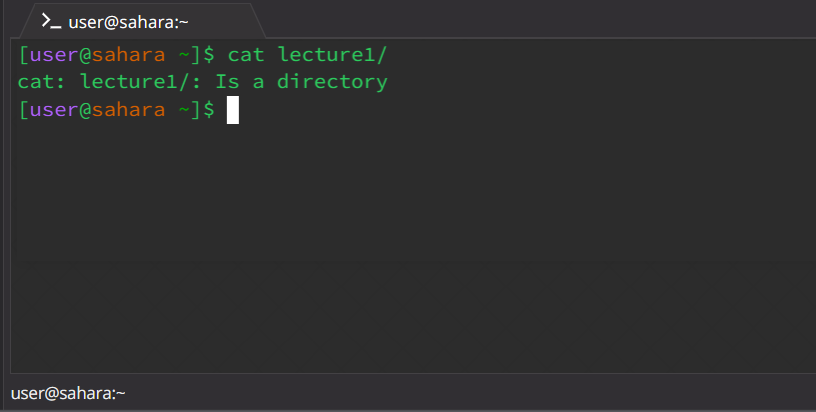
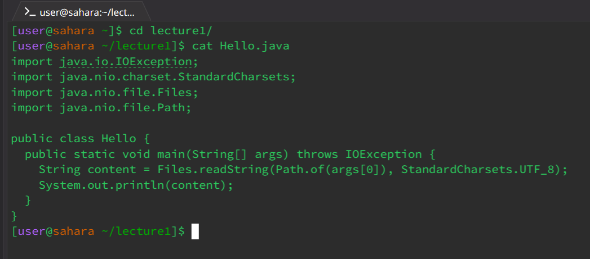

# CSE 15L Lab Report 1

There are some basic filesystem commands we used during the lectures and labs of CSE 15L.
### 1. `cd` command 
   - using the command with no arguments. \\
     \\
    Working directory: `home` ( `~` ) \\
   The command updates the current working directory to the given path. However, with no Argument, it simply does nothing. \\
   This is an error because there should be an argument giving a path to a directory. 

   - using the command with a path to a directory as an argument. \\
     \\
    Working directory: `home` ( `~` ) \\
     `lecture1` is a sub-directory under home directory. The command updates the working directory to lecture1. \\
     This is not an error.

   - using the command with a path to a file as an argument. \\
     \\
    Working directory: `lecture1/` \\
     `Hello.java` is a file in the current working directory. `ls` command works only on directories, so the working directory does not get updated. \\
     This is an error because the command takes in a path / directory, not a file.

### 2. `ls` command
   - using the command with no arguments. \\
     \\
    Working directory: `home` ( `~` ) \\
   `lecture1` is the sub-directory in `home` direcoty. This command lists files and folders in the current working directory.\
   This is not an error.

   - using the command with a path to a directory as an argument. \\
     \\
    Working directory: `home` ( `~` ) \\
     The outputs are files and folders in `lecture1/` directory. The command takes in the path of a directory and shows the files and folders in that directory. \\
     This is not an error.

   - using the command with a path to a file as an argument. \\
     \\
    Working directory:  `lecture1/` \\
   `Hello.java` is a file under `lecture1` directory. The output is just the name of the file. \\
   This is not an error. 

### 3. `cat` command
   - using the command with no arguments. \\
     \\
    Working directory: `home` ( `~` ) \\
   The command takes in, copies and outputs the user input. \\
   This is not an error.

   - using the command with a path to a directory as an argument. \\
     \\
    Working directory: `home` ( `~` ) \\
     `lecture1` is a sub-directory under `home` directory. This command only takes in files / inputs.
   This is an error because `cat` cannot copy a directory.
   - using the command with a path to a file as an argument.
     \\
    Working directory: `lecture1/` \\
   `Hello.java` is a file containing java code. The outputs are the content of the file. \\
   This is not an error.

