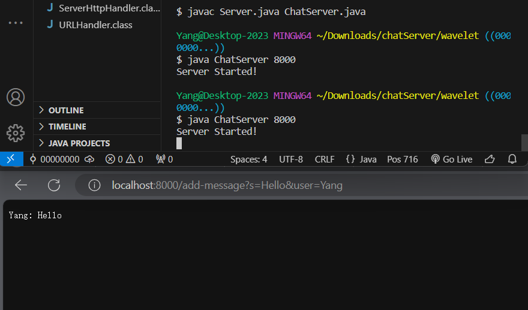
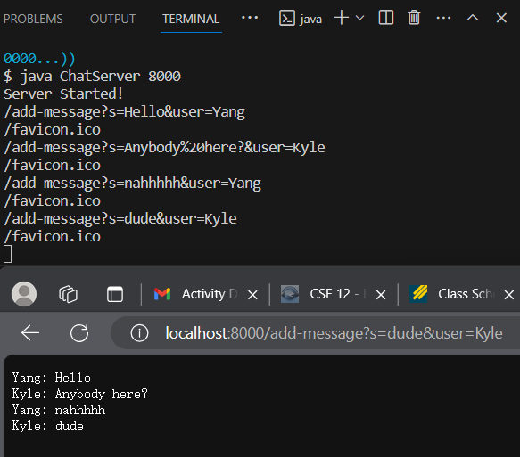

### Part 1 Create ChatServer
My chat server code: 

    import java.io.IOException;
    import java.net.URI
    
    class Handler implements URLHandler {
        // The one bit of state on the server: messages will be displayed by
        // various requests.
        String chat = "";

        public String handleRequest(URI url) {
            if (url.getPath().equals("/")) {
                return "Welcome, please enter your username and message.";
            } else {
                if (url.getPath().contains("/add-message")) {
                    String[] parameters = url.getQuery().split("&");
                    chat += String.format("%s: %s\n",parameters[1].split("=")[1],parameters[0].split("=")[1]);
                    return chat;
                }
            return "404 Not Found!";
            }
        }
    }

    class ChatServer {
        public static void main(String[] args) throws IOException {
            if(args.length == 0){
                System.out.println("Missing port number! Try any number between 1024 to 49151");
                return;
            }

            int port = Integer.parseInt(args[0]);

            Server.start(port, new Handler());
        }
    }

  
- Methods called:   
    `handleRequest(URI url)`: ths method takes in a request and returns a string as the content of a webpage.   
    `getPath()`: this method returns the path of the URL.   
    `getQuery()`: this method returns the query in a URL.   
    `String.format(String s, String s1)`: the method returns a string, in which some special charaters are replaced by the given string(s). 
    `equals()`  
    `contains()`  
    `split()`  
- argument:   
    `/add-message?s=Hello&user=Yang` the path and query part of the URL
   I typed into the browser.    
   `"/add-message"` the argument in `url.getPath().contains()`, checking if the correct path is passed in.  
   `"%s: %s\n",parameters[1].split("=")[1],parameters[0].split("=")[1]` the arguments to parse the content of queries and format them into a string.  
- relevant field:  
    `chat`: the concatenated messages on the server. The new message `"Yang: Hello"` is added to it.  
    

  
- Methods called:   
    `handleRequest(URI url)`: ths method takes in a request and returns a string as the content of a webpage.   
    `getPath()`: this method returns the path of the URL.   
    `getQuery()`: this method returns the query in a URL.   
    `String.format(String s, String s1)`: the method returns a string, in which some special charaters are replaced by the given string(s). 
    `equals()`  
    `contains()`  
    `split()`  
- argument:   
    `/add-message?s=dude&user=Kyle` the path and query part of the URL
   I typed into the browser.    
   `"/add-message"` the argument in `url.getPath().contains()`, checking if the correct path is passed in.  
   `"%s: %s\n",parameters[1].split("=")[1],parameters[0].split("=")[1]` the arguments to parse the content of queries and format them into a string.  
- relevant field:  
    `chat`: the concatenated messages on the server. The new message `Kyle: dude` is added to it.  

Which methods in your code are called?
What are the relevant arguments to those methods, and the values of any relevant fields of the class?
How do the values of any relevant fields of the class change from this specific request? If no values got changed, explain why.

### Part 2 SSH Keys and Login

### Part 3 What I learned
During these two weeks, I learned many new commands.
