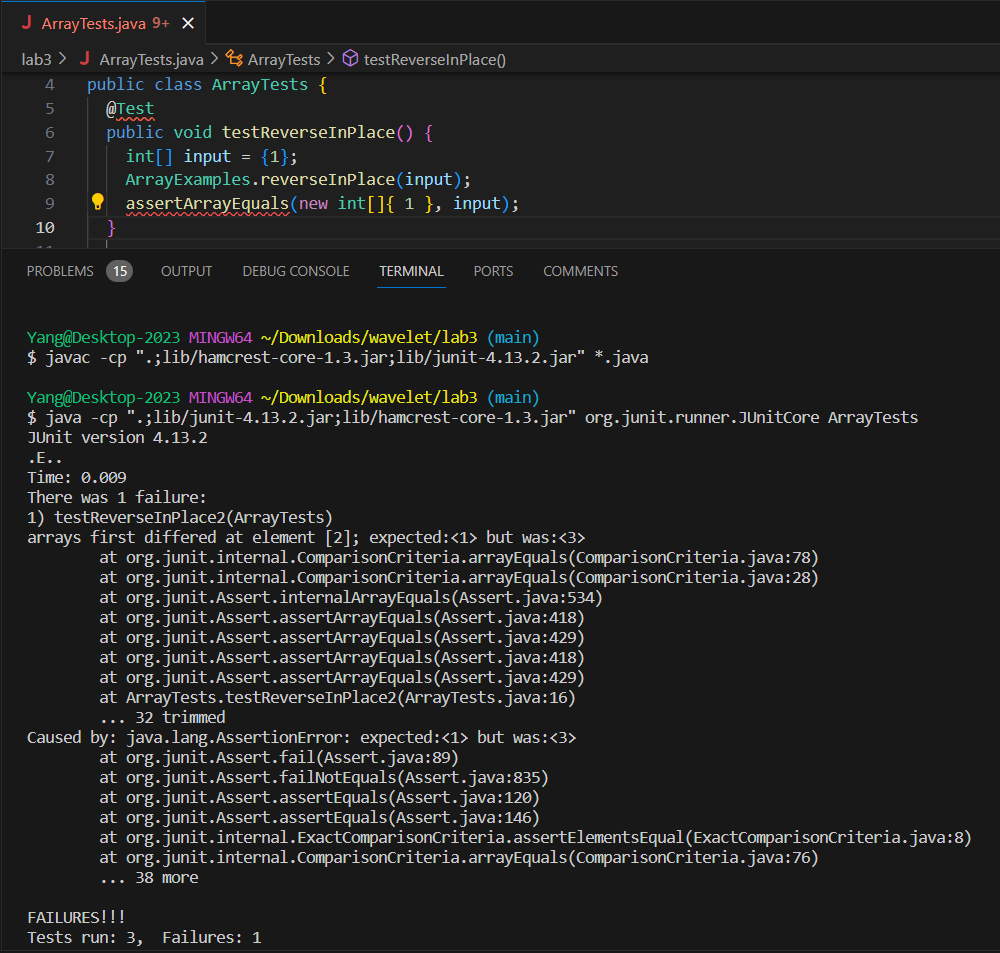

# CSE 15L Lab Report 3 - Bugs and Commands

Yang Hu  
2/8/2024

### Part 1 - Bugs

Here I will take the bug in `reverseInPlace` method in `ArrayExamples.java` from Lab 4 activities.
1. failure-inducing input for the buggy program
```
  @Test
  public void testReverseInPlace2() {
    int[] input = {1,2,3};
    int[] expected = {3,2,1};
    ArrayExamples.reverseInPlace(input);
    assertArrayEquals(expected, input);
  }
```

2. input that doesn't induce a failure 
```
public class ArrayTests {
	@Test 
	public void testReverseInPlace() {
    int[] input = {1};
    ArrayExamples.reverseInPlace(input);
    assertArrayEquals(new int[]{1}, input);
	}
```

3. the symptom 
 

4. the bug  
Before change:   
```
  static void reverseInPlace(int[] arr) {
    for(int i = 0; i < arr.length; i += 1) {
      arr[i] = arr[arr.length - i - 1];
    }
  }
```
After change:  
```
// The fixed code that reverse the array correctly
  static void reverseInPlace(int[] arr) {
    int[] temp = arr.clone();
    for(int i = 0; i < arr.length; i += 1) {
      arr[i] = temp[arr.length - i - 1];
    }
  }
```
The bug is that the array is modified before the correct value is extracted. The first half of elements are already replaced by reference to the second half of the original array when the method wants to retrieve the original element in the first half. I shallow copied the input array to a temporary array so that the indices and references are saved when assigning new values to the old array.  

### Part 2 - Researching Commands
The options of command `grep` :  
1. option `-c`  
```
$ grep -c "cell" biomed/1471-213X-1-2.txt
58
```
This option searches for "cell" in the file `1471-213X-1-2.txt` and display the count of occurance of the word "cell".[1] This can be useful for finding some keywords in a file and to determine if the file is talking about a cetain topic.
  
```
$ cat biomed/*.txt | grep -c "species"
1351
```
This example first feeds in all the contents of txt files in `biomed` direcotry and returns the count of occurance of the word "species".[1] This is useful for looking for the frequency of occurance for some word in the folder.

2. option `-A`, `-B` and `-C`:
```
$ grep -C 1 "cell" biomed/1471-213X-1-2.txt
        Cell migration is one of the most important and complex
        cellular behaviors. It is essential for animal development,
        immune system function, and wound repair. Defects in cell
        migration can lead to human diseases such as birth defects,
        and failure to control cell migration is an important step
        in tumor metastasis.
        We currently believe that migrating cells extend and
        retract actin rich protrusions, lamellipodia and filopodia,
--
        enough are stabilized and fail to retract. In this way,
        cells (or cell processes) can follow adhesive guidance
        cues. While this model has been around for some time [1],
        we are only now beginning to understand the molecular
        signals that cause cells to initiate movement, how cells
        move, the signals that guide the cell migrations, and the
        signals that stop cells at their appropriate positions.
        Recently, progress in understanding cell migration has
        come from studies of
        Caenorhabditis elegans and
        Drosophila [2]. Most cell migration
        genes identified in these simple invertebrates are
        conserved in vertebrates, which confirms the efficacy of
        these genetically tractable systems for studying cell
        migration.
```
This option gives lines both before and after the keyword.[1] This is very useful because it shows more context about the found word.

```
$ grep -A 1 "example" biomed/1471-213X-1-2.txt
          PLMs. Figure 3shows an example of a normal PLM in strain
          TU2562 and several examples of PLMs with axonal defects
          in strain EA485. All of the 189 PLMs scored in TU2562 had
```
This option gives lines after the keyword. [1] This is useful for getting the examples in the file.

3. option `-i`
```
$ grep -ic "cell" biomed/1471-213X-1-2.txt
59
```
This option makes the search case-insensitive so that it can find some words that are at the biggning of the sentence.[1] Here we can see that the number of occurance of the word is higher and more accurate. 

```
$ grep -ir "unix" .
./biomed/1471-2105-3-2.txt:            software on Macintosh, Windows, and Unix computer
./biomed/1471-2105-3-2.txt:            http://www.mrunix.net/webalizer/).
./biomed/1471-2105-3-28.txt:          using the unix clock() function. Compute time was also
./biomed/1471-2164-3-4.txt:        http://www.stuffit.com/, or unzip utility for Unix. The
./biomed/1471-244X-2-9.txt:        Data were tested using Unix-based tools including xmstat
./biomed/gb-2002-3-12-research0078.txt:          scripts are written in JAVA, they can be run on Unix,
./biomed/gb-2002-3-12-research0081.txt:        a basic understanding of Unix and bioinformatics tools, as
./biomed/gb-2002-3-12-research0081.txt:          the directories as all other BDGP Unix computers. The
./biomed/gb-2002-3-9-research0043.txt:          UNIX platforms (Sun, SGI, Compaq) was used to carry out
./biomed/gb-2003-4-2-r14.txt:          length (from UNIX wc command) divided by 3 was used to
./biomed/gb-2003-4-4-r26.txt:          was performed in a Unix environment using Perl and Bourne
```
This command gets useful when it is searching for words that could be incorrectly capitalized.[1]

4. option `-m'
```
$ grep -m1 "Bin Ladin" 911report/*
911report/chapter-10.txt:                    Bin Ladin;
911report/chapter-11.txt:                major national survey. Bin Ladin, al Qaeda, or even terrorism was not an important
911report/chapter-12.txt:            As we mentioned in chapter 2, Usama Bin Ladin and other Islamist terrorist leaders
911report/chapter-13.2.txt:                world audience and signed by Usama Bin Ladin, Ayman al Zawahiri (emir of the
911report/chapter-13.3.txt:            2. "Hunting Bin Ladin," PBS Frontline broadcast, May 1998 (online at
911report/chapter-13.4.txt:            1. Though KSM and Bin Ladin knew each other from the anti-Soviet campaign of the
911report/chapter-13.5.txt:                have been part of the planes operation but was held in reserve by Bin Ladin for a
911report/chapter-2.txt:            In February 1998, the 40-year-old Saudi exile Usama Bin Ladin and a fugitive Egyptian
911report/chapter-3.txt:                organization-especially from 1988 to 1998, when Usama Bin Ladin declared war and
911report/chapter-5.txt:                reportedly failed in his attempt to meet with Bin Ladin. But KSM did see Atef, who
911report/chapter-6.txt:                agencies and capacities to address the emerging threat from Usama Bin Ladin and his
911report/chapter-7.txt:                qualifications for this plot were their devotion to Usama Bin Ladin, their veteran
911report/chapter-8.txt:                operational information relating to Usama Bin Ladin.
```
This option stands for "max number of lines". It stops the search after the input number of lines are found in a file.[2] This is very useful for a lot of outputs, when you only want see one match per file.

```
$ grep -m3 "cell" biomed/1471-213X-1-2.txt
        cellular behaviors. It is essential for animal development,
        immune system function, and wound repair. Defects in cell
        and failure to control cell migration is an important step
```
Or, it is useful when the output is too long and we want only the first 3 results in the file.[2]  

	[1]: https://www.geeksforgeeks.org/grep-command-in-unixlinux/#
	[2]: https://www.howtogeek.com/496056/how-to-use-the-grep-command-on-linux/
