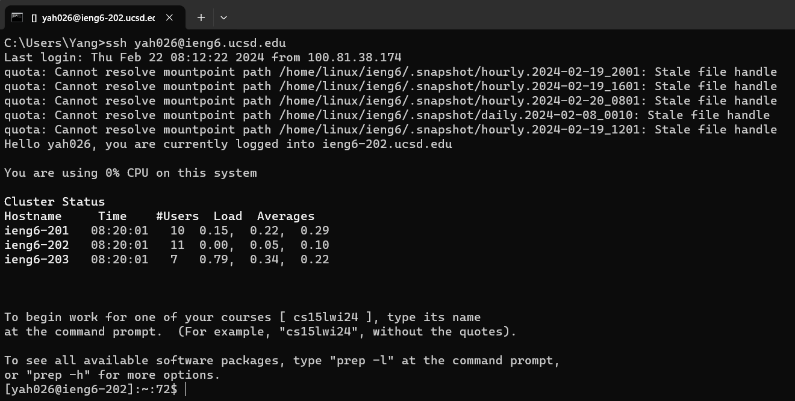
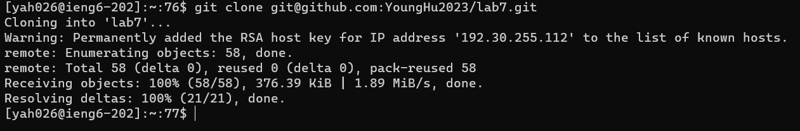
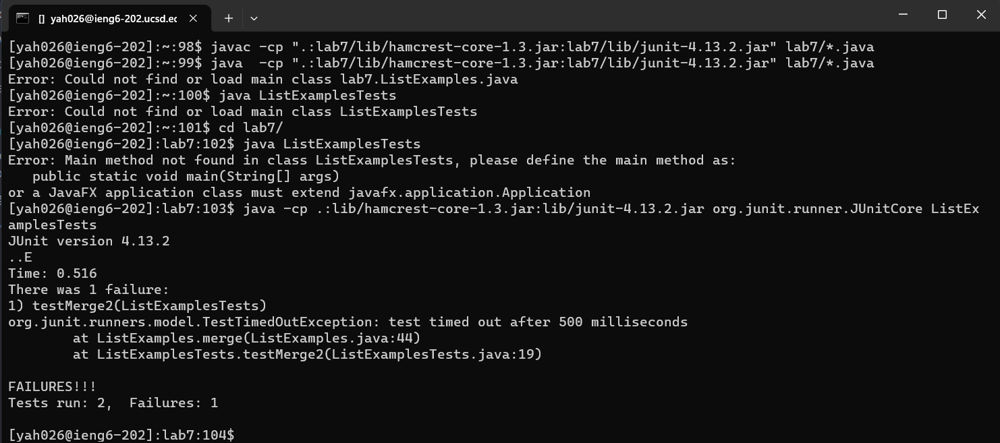
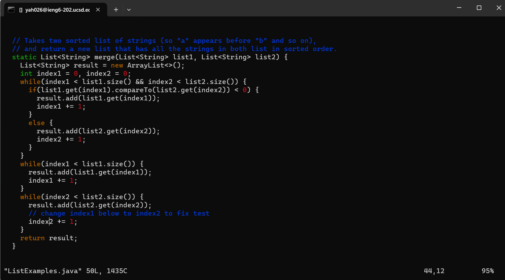
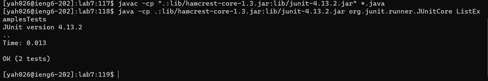
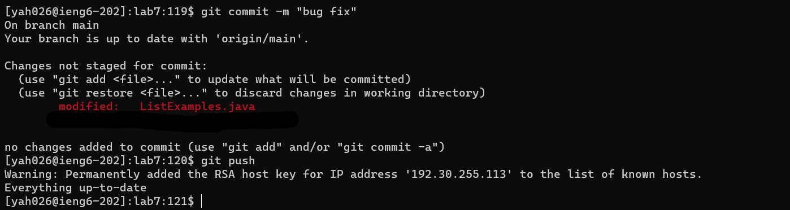

# CSE 15L Lab Report 4 - Vim

Yang Hu  
2/8/2024  

### Step 1 Log into ieng6 
  
Keys pressed: <up><up><up><up><up><up><up><up><enter>  
This is from my command history. It logs me onto the CSE server using ssh. 
Command run: `ssh yah026@ieng6.ucsd.edu`  

### Step 2 Clone fork of the repository  
  
Keys pressed: <up><up><up><up><up><up><up><up><enter>  
This is from my command history. It copies the directory on Github to this server.
Command run: `git clone git@github.com:YoungHu2023/lab7.git`  

### Step 3 Run the tests  
  
Keys pressed: `cd l<tab><enter><up><up><up><up><up><up><up><up><up><enter><up><up><up><up><up><up><up><up><up><enter>`  
The first command goes into the lab7/ directory. The second and the third commands are from my command history. They complie and run the test library and test file.
Command run: `cd lab7/  
javac -cp ".:lab7/lib/hamcrest-core-1.3.jar:lab7/lib/junit-4.13.2.jar" lab7/*.java  
java -cp .:lib/hamcrest-core-1.3.jar:lib/junit-4.13.2.jar org.junit.runner.JUnitCore ListExamplesTests`  

### Step 4 Edit the code file to fix the failing test  
  
Keys pressed: `vim L<tab>T<tab><enter>44Ger2:x<enter>`   
This command opens the vim application. Then I use it to edit the file. 
Command run: `vim ListExamples.java` and vim internal commands `44Ger2:x<enter>`

### Step 5 Run the tests again  
  
Keys pressed: `<up><up><up><enter><up><up><up><enter>`  
This is from my command history. I rerun the compile and run commands.  
Command run: `cd lab7/  
javac -cp ".:lab7/lib/hamcrest-core-1.3.jar:lab7/lib/junit-4.13.2.jar" lab7/*.java  
java -cp .:lib/hamcrest-core-1.3.jar:lib/junit-4.13.2.jar org.junit.runner.JUnitCore ListExamplesTests`  

### Step 6 Commit and push the change  
  
Keys pressed: `<up><up><up><up><up><up><up><up><enter>`  
This is from my command history.  
Command run: git commit -m "bug fix" && git push origin main
