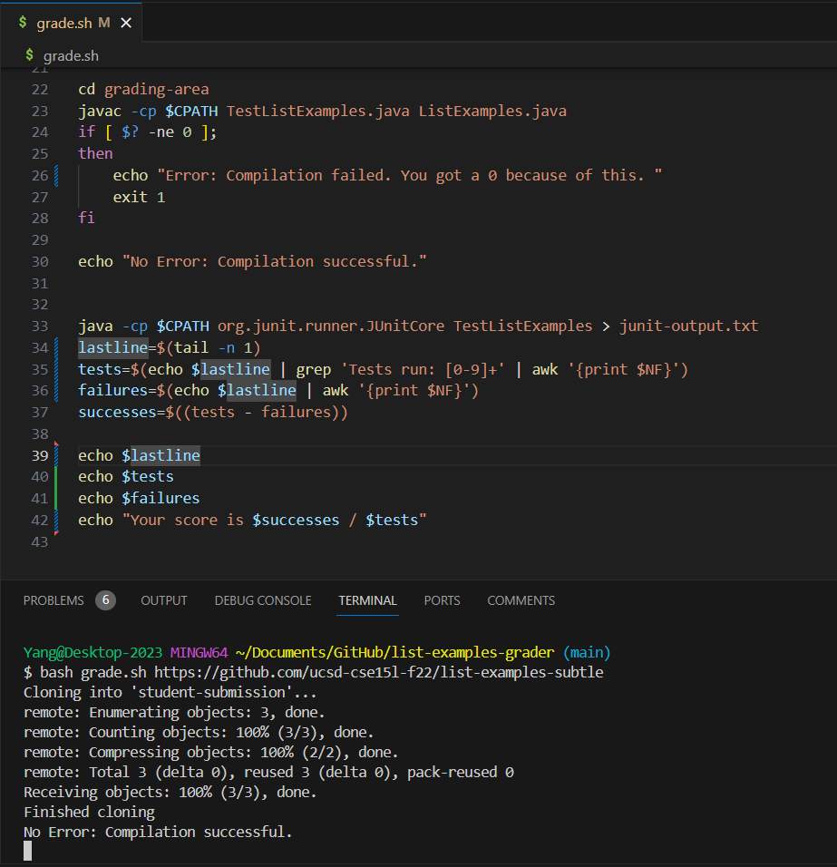
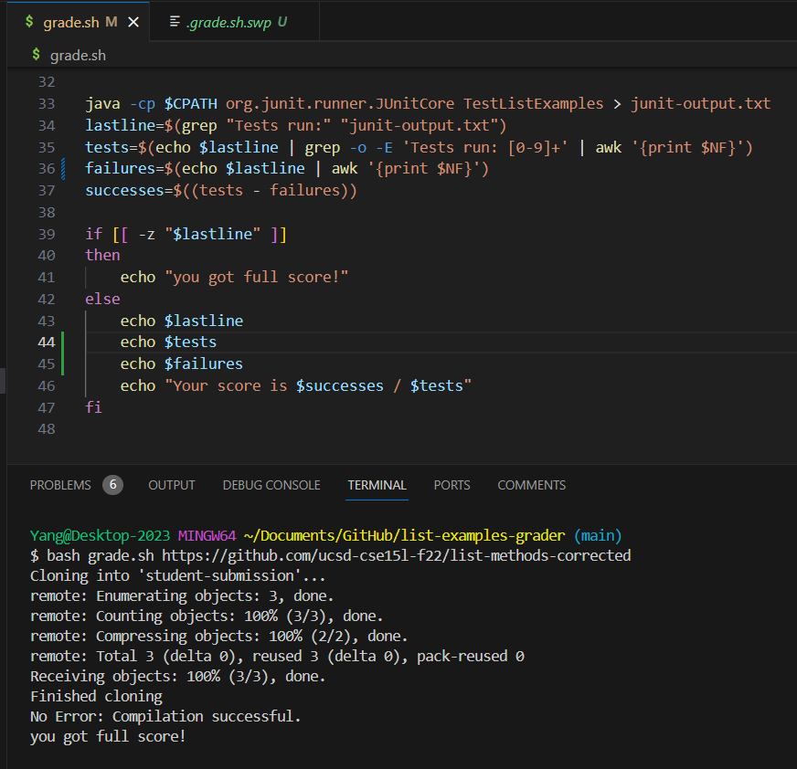

# CSE 15L Lab Report 5 - Putting It All Together

Yang Hu  
3/7/2024  

### Part 1 - Debugging Scenario
1. Edstem Post  
## How to solve this bug in my grade.sh?  #321
Anonymous                                   182  
5 days ago in Lab REports                              VIEWS  
  
I got this result when I was running a correct implementation of ListExamples.java in `grade.sh`. Why is the final score not correct?    
  
This is my file and directory structure:  
```
- list-examples-grader
    - lib  
      - hamcrest-core-1.3.jar  
      - junit-4.13.2.jar  
    - grading area  
    - student-submission
    - grade.sh
    - TestListExamples.java`
```

The contents of each file before fixing the bug:  
The full command line (or lines) I ran to trigger the bug:  
`bash grade.sh https://github.com/ucsd-cse15l-f22/list-methods-corrected`  
My speculation would be that the test is not running correctly.  
Thank you!  

Comment ···  

### 1 Answer  
Yang Hu <span style="font-size:0.5">STAFF</span>  
2 hours ago  

You can start to debug this by inserting print statements in your java and bash script, especially around the output of the test!  
In bash scripts, `cat` and `echo` commands might be helpful.  

     Anonymous  
     1h  
     Now I totally get it - it was because my grep command to get $lastline was empty. There are always two empty lines in the output of JUnit tests.  
     I fixed it by grabbing the line with "Test run:".  
     I edited the 34th line of `grade.sh` to `lastline=$(grep "Tests run:" "junit-output.txt")`. The fiexed `grade.sh` is shown below.  
     Thank you very much!  
       
  
     Reply ···  

      

### Part 2 - Reflection  
 The most useful thing I learnt in the second half of this quarter is Java Debugger. It provides a good way to look into the buggy part of your code and to find out where your code went wrong.  
 The other thing that really helps is the practice on bash scripts. Using Bash (or the Process class in Java) gives a very flxible way to inspect and modify a file system. It was cool.


